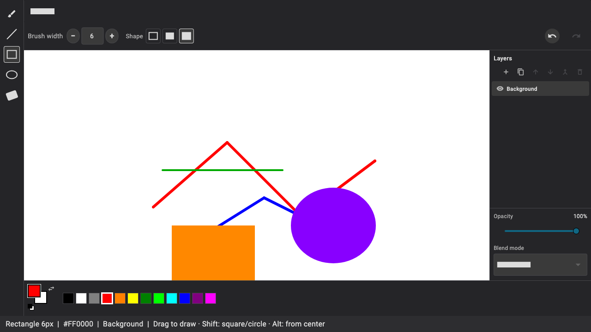

# VibePaint

A vibe coded paint app.



## Features

- **Canvas** — white document that fills the space between the toolbar and color bar
- **Brush, line, rectangle, ellipse & eraser** — freehand paint, straight segments, and outlined or filled shapes
- **Shape modifiers** — Shift constrains lines to 45°, rectangles to squares, ellipses to circles; Alt draws from center
- **Shape style** — outline, filled, or filled with outline (rectangle & ellipse)
- **Toolbar** — tool picker on the left, brush width above the canvas
- **Canvas background** — separate from layers; choose via the Canvas color well or when creating a new image (includes transparent)
- **Color wells** — classic overlapping primary and background swatches with swap and reset; click a well, then pick a preset (background well includes transparent)
- **Undo & redo** — step through stroke history on the active layer (toolbar buttons or ⌘Z / ⌘⇧Z)
- **Layers** — stack transparent layers (top of list = front), show/hide, reorder, opacity, blend modes, duplicate, merge down, and rename; eraser clears pixels on the active layer
- **File menu** — New, Open, Save, and Save As (macOS menu bar; in-window on Windows and Linux)
- **Image formats** — Save As supports PNG, JPEG, BMP, GIF, and WebP; macOS uses the system save panel format menu
- **Document title** — filename in the window title; `*` prefix when there are unsaved changes
- **Desktop** — macOS, Windows, and Linux

## Roadmap

Rough order of obvious next steps:

- [x] **Color picker** — primary color swatch (and eventually secondary)
- [x] **Brush size** — adjustable width
- [x] **Eraser** — paint back to white
- [x] **Undo / redo** — history for brush strokes
- [x] **New / clear** — reset the canvas
- [x] **Save & open** — PNG export and import
- [ ] **More tools** — fill bucket (line, rectangle & ellipse done)
- [x] **Toolbar** — tool buttons on the side
- [ ] **Zoom & pan** — navigate large canvases
- [x] **Layers** — stack and edit images independently

## Run

Requires [Flutter](https://docs.flutter.dev/get-started/install) with desktop support enabled.

```bash
flutter pub get
flutter run -d macos    # or windows / linux
```

## Releases

CI runs on every push and pull request to `master`.

To publish a release with Windows, Linux, and macOS binaries:

**Automatic (recommended):** open **Actions → Release → Run workflow** and click **Run workflow**. The version auto-increments the patch number from the latest `v*` tag (or uses `pubspec.yaml` for the first release), updates `pubspec.yaml`, and creates the GitHub release.

You can optionally enter a specific version (e.g. `0.2.0`) to override auto-increment.

**Manual tag:**

```bash
git tag v0.1.0
git push origin v0.1.0
```

## License

MIT — see [LICENSE](LICENSE).
